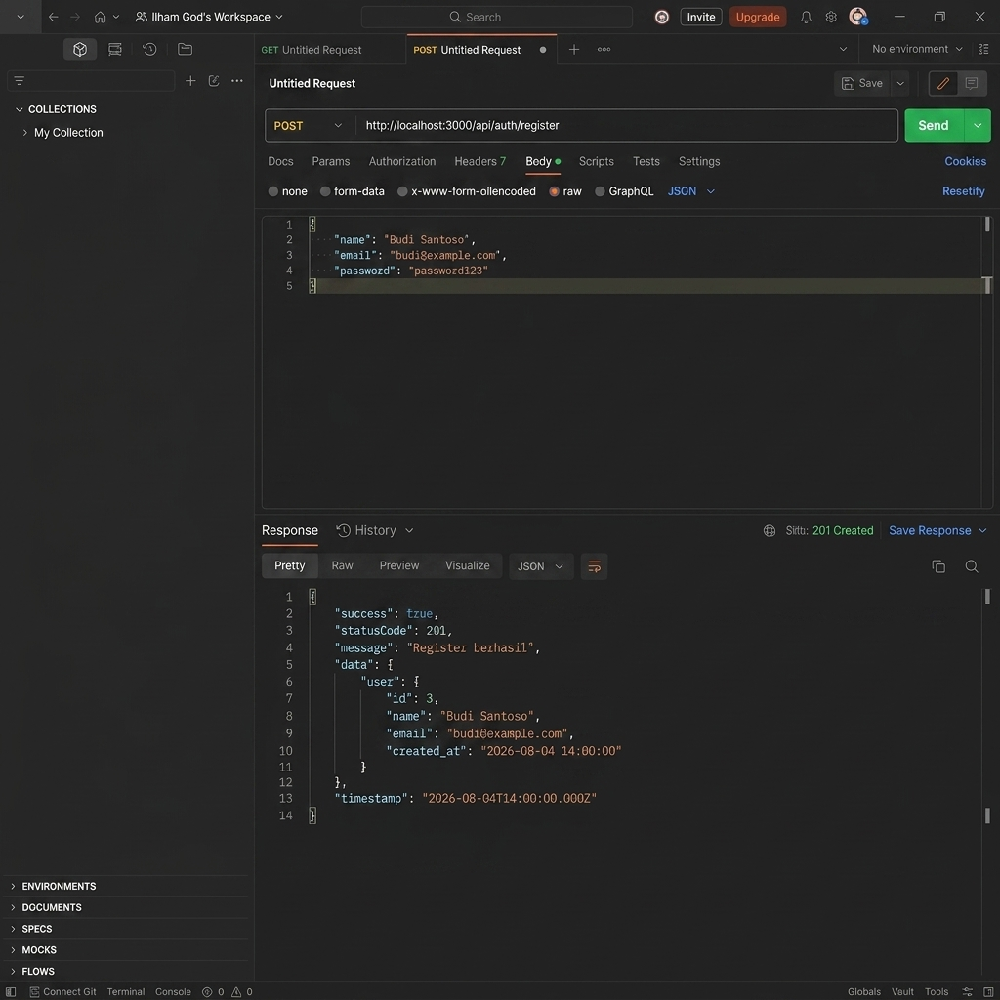
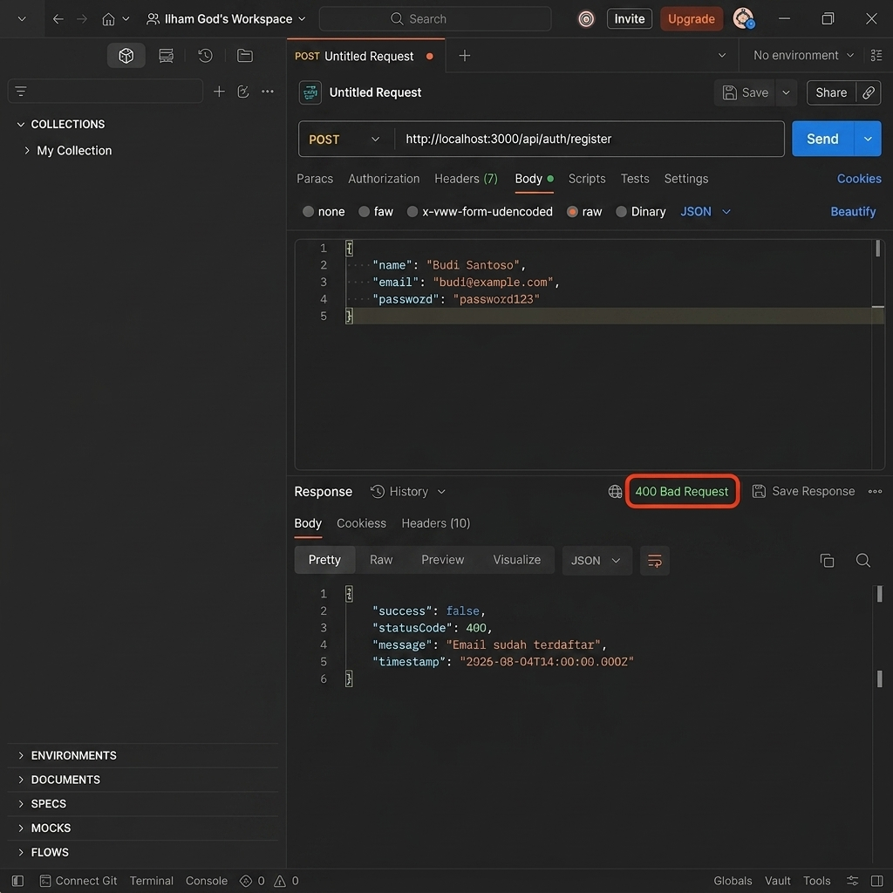
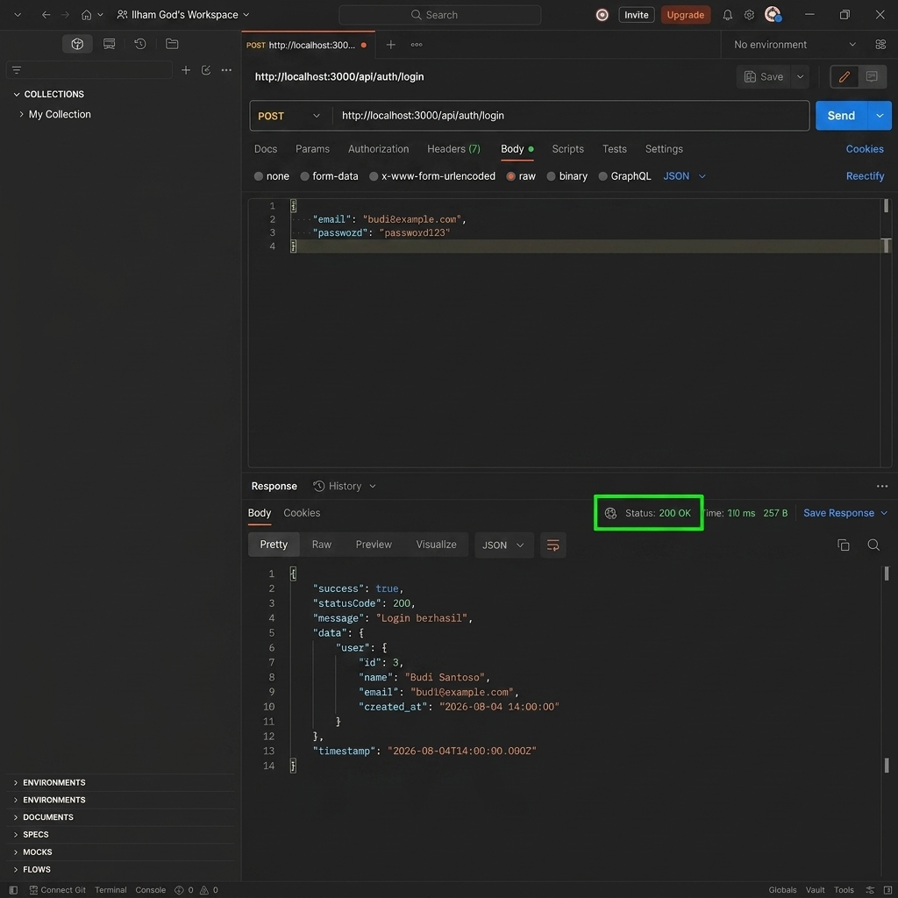

# Express + SQLite API (MVC Pattern) - PAW Week 7

REST API sederhana dengan arsitektur **MVC (Model – Controller – Route)** menggunakan **Express.js** dan **SQLite**.
Tugas ini melengkapi fitur **Register** dan melakukan pengujian pada endpoint **Login** & **Register**.

---

## 📁 Struktur Project

```
src/
├── config/
│   └── database.js           # Koneksi & inisialisasi schema SQLite
├── models/
│   └── user.model.js          # Query + logic dasar user (hash/compare password via bcrypt)
├── controllers/
│   └── auth.controller.js     # Terima request, validasi input, panggil Model, kirim response
├── routes/
│   ├── index.js                # Aggregator route + health check
│   └── auth.routes.js          # Endpoint /api/auth/* (login & register)
├── middlewares/
│   └── errorHandler.middleware.js  # 404 handler + global error handler
├── utils/
│   └── ApiResponse.js          # Helper response standar (sendSuccess / sendError)
├── database/
│   ├── seed.js                 # Seeder user demo
│   └── app.db                   # File database SQLite
├── app.js                       # Konfigurasi Express
└── server.js                    # Entry point aplikasi
```

---

## 🚀 Cara Menjalankan Project

```bash
# 1. Install dependensi
npm install

# 2. Salin environment config
cp .env.example .env

# 3. Jalankan database seeder (membuat tabel & user demo)
npm run seed

# 4. Jalankan server dalam mode development
npm run dev
```

Server berjalan di `http://localhost:3000`.

---

## 🔑 Akun Demo (dari Seed)

| Email | Password |
| --- | --- |
| `admin@example.com` | `12345678` |
| `user@example.com` | `12345678` |

---

## 📡 Endpoints API

### 1. Health Check
- **`GET /api/health`**
- **Response**: Memberikan status kesehatan service dan uptime.

---

### 2. Authentication

#### `POST /api/auth/register` (Register User Baru)
- **Body Request (JSON)**:
  ```json
  {
    "name": "Budi Santoso",
    "email": "budi@example.com",
    "password": "password123"
  }
  ```
- **Response Sukses (`201 Created`)**:
  ```json
  {
    "success": true,
    "statusCode": 201,
    "message": "Register berhasil",
    "data": {
      "user": {
        "id": 3,
        "name": "Budi Santoso",
        "email": "budi@example.com",
        "created_at": "2026-08-04 14:00:00"
      }
    },
    "timestamp": "2026-08-04T14:00:00.000Z"
  }
  ```
- **Response Gagal - Email Sudah Terdaftar (`400 Bad Request`)**:
  ```json
  {
    "success": false,
    "statusCode": 400,
    "message": "Email sudah terdaftar",
    "timestamp": "2026-08-04T14:00:00.000Z"
  }
  ```
- **Response Gagal - Field Kosong (`400 Bad Request`)**:
  ```json
  {
    "success": false,
    "statusCode": 400,
    "message": "Nama, email, dan password wajib diisi",
    "timestamp": "2026-08-04T14:00:00.000Z"
  }
  ```

---

#### `POST /api/auth/login` (Login User)
- **Body Request (JSON)**:
  ```json
  {
    "email": "budi@example.com",
    "password": "password123"
  }
  ```
- **Response Sukses (`200 OK`)**:
  ```json
  {
    "success": true,
    "statusCode": 200,
    "message": "Login berhasil",
    "data": {
      "user": {
        "id": 3,
        "name": "Budi Santoso",
        "email": "budi@example.com",
        "created_at": "2026-08-04 14:00:00"
      }
    },
    "timestamp": "2026-08-04T14:00:00.000Z"
  }
  ```

---

## 📸 Hasil Pengujian API (Screenshots Test)

Berikut adalah dokumentasi hasil pengujian API menggunakan REST client / Postman:

### 1. Pengujian Register User Baru (Sukses - Status 201 Created)

> **Keterangan**: Screenshot di atas menampilkan pengujian endpoint `POST /api/auth/register` dengan mengirimkan data `name`, `email`, dan `password`. Server berhasil mendaftarkan user baru ke database, meng-hash password menggunakan `bcryptjs`, dan mengembalikan data user tanpa menyertakan password dengan status HTTP `201 Created`.

---

### 2. Pengujian Register dengan Email Terdaftar (Gagal - Status 400 Bad Request)

> **Keterangan**: Screenshot di atas menampilkan pengujian penanganan validasi ketika pendaftaran dilakukan menggunakan email yang sudah terdaftar sebelumnya di database. Server menolak pendaftaran dan mengembalikan response error ber-status HTTP `400 Bad Request` dengan pesan `"Email sudah terdaftar"`.

---

### 3. Pengujian Login Akun Terdaftar (Sukses - Status 200 OK)

> **Keterangan**: Screenshot di atas menampilkan pengujian login menggunakan akun yang baru saja dibuat melalui endpoint register. Server mencocokkan password polos dengan hash di database menggunakan `bcryptjs.compareSync` dan mengembalikan response sukses HTTP `200 OK` beserta data profil user.

---

## 🛠️ Tech Stack

- **Express.js** — Framework web backend Node.js
- **better-sqlite3** — Driver database SQLite synchronous & cepat
- **bcryptjs** — Hashing password yang aman
- **nodemon** — Auto-reload server saat pengodean
- **cors & morgan** — Middleware CORS dan HTTP Logger
